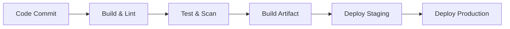

# Deployment Pipeline & DevOps

This skill covers the **path to production**. It ensures that code is automatically tested, built, containerized, and deployed reliably using modern DevOps practices.

## When to Use

- Setting up CI/CD workflows (GitHub Actions, GitLab CI)
- Dockerizing an application for production
- Deploying to Kubernetes (Helm, Manifests)
- Configuring Infrastructure as Code (Terraform)
- Planning a deployment strategy (Blue/Green, Canary)
- Implementing GitOps with ArgoCD
- Troubleshooting build or deployment failures

## 1. CI/CD Principles

### Pipeline Architecture



### Workflow Triggers

- **Pull Request**: Run fast checks (Lint, Unit Tests, Type Check).
- **Push to Main**: Run heavier checks (Integration Tests, Build, Deploy to Staging).
- **Release/Tag**: Deploy to Production.

### Pipeline Stages

1.  **Lint & Static Analysis**: `eslint`, `prettier`, `tsc`. Fail fast.
2.  **Test**: Unit tests (`vitest/jest`) and Integration tests.
3.  **Security Scan**: `npm audit`, `trivy` (container scan).
4.  **Build**: `npm run build` or `docker build` (Multi-stage).
5.  **Deploy**: Update K8s manifest, upload to S3, or trigger serverless deploy.

> **Templates**:
>
> - [GitHub Actions Workflow](templates/github-actions-ci.yml)
> - [GitLab CI Pipeline](templates/gitlab-ci.yml)

## 2. Containerization (Docker)

### Dockerfile Best Practices

- **Multi-Stage Builds**: Separate build tools from runtime image.
- **Base Images**: Use `alpine` or `slim` variants (e.g., `node:20-alpine`).
- **Security**: Run as non-root user (`USER node`).
- **Layers**: Order instructions from least to most frequent change.

> **Templates**:
>
> - [Node.js Dockerfile](templates/Dockerfile.node)
> - [Python Dockerfile](templates/Dockerfile.python)

## 3. Kubernetes & Orchestration

### Essential Manifests

- **Deployment**: Defines replicas, rolling update strategy, and container spec.
- **Service**: Internal load balancer for pod discovery.
- **Ingress**: External access rule (HTTP/HTTPS).
- **ConfigMap/Secret**: Configuration injection (env vars).

### Security Context

Always apply least privilege at the pod level:

```yaml
securityContext:
  runAsNonRoot: true
  readOnlyRootFilesystem: true
  allowPrivilegeEscalation: false
```

### Resource Management

Always set requests and limits to ensure stability:

```yaml
resources:
  requests:
    cpu: "100m"
    memory: "128Mi"
  limits:
    cpu: "500m"
    memory: "512Mi"
```

> **Templates**:
>
> - [K8s Deployment](templates/k8s-deployment.yaml)
> - [Helm Values](templates/helm-values.yaml)

## 4. Infrastructure as Code (IaC)

Use Terraform for reproducible infrastructure.

- **State Management**: Remote state (S3 + DynamoDB locking).
- **Modules**: Reusable components (VPC, EKS, RDS).
- **Separation**: Separate environments (dev, staging, prod) via workspaces or directory structure.

## 5. Deployment Strategies

| Strategy       | Description                          | Pros                   | Cons                      |
| :------------- | :----------------------------------- | :--------------------- | :------------------------ |
| **Rolling**    | Replace instances one by one         | Zero downtime, cheap   | Version mix during window |
| **Blue/Green** | Stand up parallel env, switch router | Instant rollback, safe | Double resource cost      |
| **Canary**     | Route % of traffic to new version    | Test in prod safe-ish  | Complex routing needed    |

> See [Rollback Procedures](rollback-procedures.md) for recovery protocols.

## 6. GitOps (ArgoCD)

- **Single Source of Truth**: Git repository contains all K8s manifests.
- **Automated Sync**: ArgoCD detects drift between Git and Cluster.
- **Self-Healing**: Automatically reverts manual changes to the cluster.

## 7. Security in Pipeline

- **Secrets**: Use GitHub Secrets/Vault. Never commit `.env` or keys.
- **Image Scanning**: Scan for CVEs before pushing registry.
- **Least Privilege**: CI tokens should have minimal scopes.

## Implementation Checklist

### Pre-Deployment

- [ ] **Linter & Tests** pass on PR?
- [ ] **Security Scan** (trivy/dependabot) is clean?
- [ ] **Secrets** injected securely (Vault/K8s Secrets)?
- [ ] **Dockerfile** uses multi-stage & non-root user?

### Deployment

- [ ] **Env Vars** validated on startup?
- [ ] **Readiness/Liveness Probes** configured?
- [ ] **Resource Limits** defined?

### Post-Deployment

- [ ] **Health Checks** return 200 OK?
- [ ] **Logs** show no critical startup errors?
- [ ] **Alerts** configured for high error rates?

> See [Troubleshooting Guide](troubleshooting.md) for common issues.
