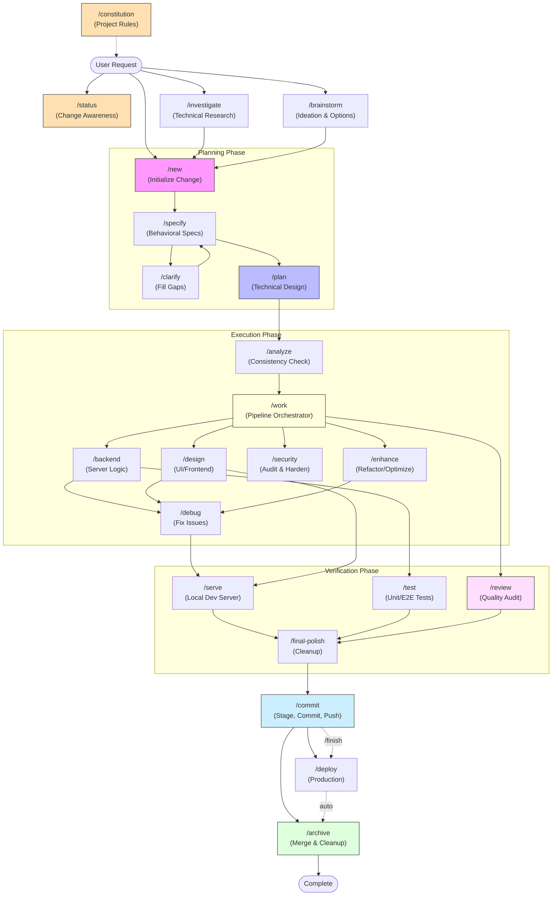

# Specwright Project Lifecycle

Specwright is designed around a structured lifecycle that moves from abstract ideas to concrete, verified code. Below is a visual map of the "Happy Path" and how various workflows support different stages of development.

## 🗺️ The Workflow Map

---

## 🚀 The "Happy Path" Explained

The **Happy Path** is the most robust way to ensure high-quality output. It follows a "Measure Twice, Cut Once" philosophy.

1.  **`/new`**: Always start here. It creates your sandbox and a **Proposal**.
2.  **`/specify`**: Define **what** the feature does and **why** (User Stories, Acceptance Criteria, Constraints).
3.  **`/plan`**: Design **how** it will be built (Architecture, Research & Task List).
4.  **`/analyze`**: Cross-artifact consistency check — verify spec → plan → tasks before any code is written.
5.  **Implementation**: Use specialized agents like **`/backend`** or **`/design`**, or let `/work` auto-orchestrate.
6.  **`/test` & `/serve`**: Verify the work functions correctly and looks great.
7.  **`/commit`**: Stage, commit (conventional), and push your changes. Always pushes.
8.  **`/archive`**: The final step. It snapshots your specs (frozen copy tagged with commit hash), merges them into the main documentation, and cleans up the change folder.

## ⚡ Automation & Support

- **`/finish` (Ship & Close)**: Chains commit → deploy → archive. Deploy auto-detects the project's deploy method.
- **`/status` (Change Awareness)**: Shows artifact existence, task progress, and suggested next action for any active change. Use at the start of a session to re-orient.
- **`/analyze` (Consistency Gate)**: Pre-implementation audit — checks spec → plan → tasks alignment. Run after `/plan`, before `/work`.
- **`/work` (Pipeline)**: Auto-executes tasks by workflow tag: `/backend` → `/design` → `/security` → `/enhance` → `/test`. Use after `/analyze` confirms readiness.
- **`/review` (Quality Audit)**: Runs specialist agents over auto-proceeded work to catch issues.
- **`/brainstorm` & `/investigate`**: Use these **before** you even run `/new`. They help you decide if a change is viable or what the best approach might be.
- **`/second-opinion`**: Stress-test any plan or design decision with a rigorous expert review. Use ad-hoc at any stage.
- **`/coach`**: Can be toggled on at any time to help you learn which tool to use next!

## 🛠️ Maintenance Workflows

- **`/debug`**: For fixing existing issues.
- **`/enhance`**: For making good code better without changing functionality.
- **`/security`**: For hardening the application.

---

## 💎 Obsidian Integration

This toolkit is optimized for use with **Obsidian**.

- **Visual Graph**: Open the toolkit root in Obsidian to see the relationships between agents, workflows, and your active `changes/` folders in the Graph View.
- **Mermaid Support**: The diagrams in these docs (like the one above) will render natively, providing a live visual map of your project's status.
- **Knowledge Management**: Use Obsidian to link technical research from `/investigate` back to your core project documentation.
