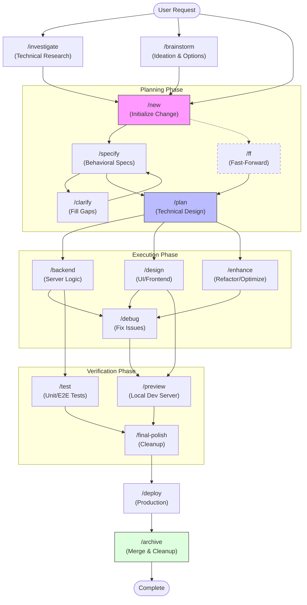

# Agentic Toolkit Project Lifecycle

The Agentic Toolkit is designed around a structured lifecycle that moves from abstract ideas to concrete, verified code. Below is a visual map of the "Happy Path" and how various workflows support different stages of development.

## 🗺️ The Workflow Map

---

## 🚀 The "Happy Path" Explained

The **Happy Path** is the most robust way to ensure high-quality output. It follows a "Measure Twice, Cut Once" philosophy.

1.  **`/new`**: Always start here. It creates your sandbox and a **Proposal**.
2.  **`/specify`**: Define **what** the feature does and **why** (User Stories & Acceptance Criteria).
3.  **`/plan`**: Design **how** it will be built (Architecture & Task List).
4.  **Implementation**: Use specialized agents like **`/backend`** or **`/design`**.
5.  **`/test` & `/preview`**: Verify the work functions correctly and looks great.
6.  **`/archive`**: The final step. It merges your "Delta Specs" into the main documentation and cleans up the change folder.

## ⚡ Fast-Tracks & Support

- **`/ff` (Fast-Forward)**: Use this for simple tasks where you want to jump from a Proposal to a full Plan/Task list in one step.
- **`/brainstorm` & `/investigate`**: Use these **before** you even run `/new`. They help you decide if a change is viable or what the best approach might be.
- **`/coach`**: Can be toggled on at any time to help you learn which tool to use next!

## 🛠️ Maintenance Workflows

- **`/debug`**: For fixing existing issues.
- **`/enhance`**: For making good code better without changing functionality.
- **`/security`**: For hardening the application.

---

## 💎 Obsidian Integration

This toolkit is optimized for use with **Obsidian**.

- **Visual Graph**: Open the toolkit root in Obsidian to see the relationships between agents, workflows, and your active `changes/` folders in the Graph View.
- **Mermaid Support**: The diagrams in these docs (like the one above) will render natively, providing a live visual map of your project's status.
- **Knowledge Management**: Use Obsidian to link technical research from `/investigate` back to your core project documentation.
