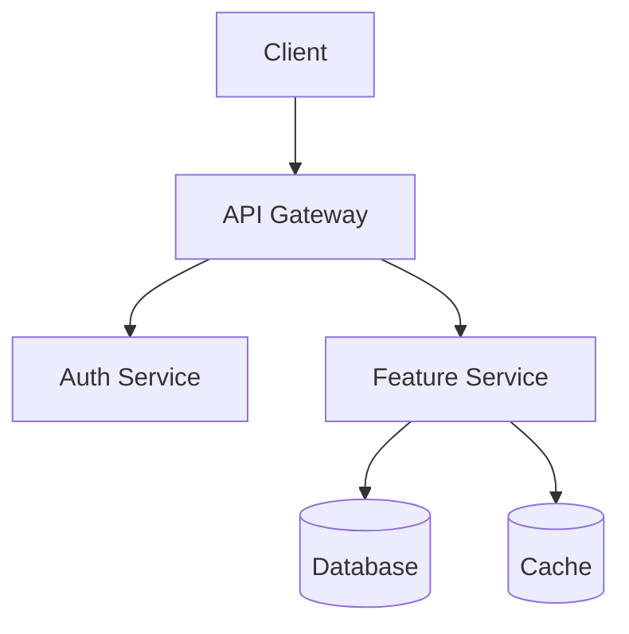

# System Design Architect

This skill transforms high-level ideas into concrete, code-ready blueprints and comprehensive design documentation.

> **Integration Note**: This skill uses `prompt-engineering` for "Structured Output" (File Trees) and "Chain-of-Thought" (Architecture decisions).

---

## 1. Design Document Protocol

**Use when**: "Create a design doc", "Plan this feature", "Document the architecture".

> **Instruction**:
>
> Follow this 7-step process to create comprehensive design documentation:
>
> ### Step 1: Requirements Analysis
>
> - Identify all functional requirements
> - Define non-functional requirements (performance, security, scalability)
> - List constraints (technology stack, timeline, resources)
> - Map integration points with existing systems
>
> ### Step 2: Research & Context
>
> - Research technology choices and alternatives
> - Identify third-party integrations
> - Document findings with sources and impact on design
>
> ### Step 3: Define System Architecture
>
> - Create high-level system overview
> - Define component responsibilities
> - Document data flow between components
> - Record technology decisions with rationale
>
> ### Step 4: Design Components & Interfaces
>
> For each major component, document:
>
> - Purpose and responsibilities
> - Inputs, outputs, and dependencies
> - API definitions (TypeScript interfaces or equivalent)
>
> ### Step 5: Define Data Models
>
> For each entity:
>
> - Properties with types and validation rules
> - Relationships to other entities
> - Example JSON representation
>
> ### Step 6: Plan Error Handling
>
> - Categorize errors (validation, auth, external, system)
> - Define response strategy (HTTP codes, messages, actions)
> - Document recovery mechanisms (retries, fallbacks, circuit breakers)
>
> ### Step 7: Define Testing Strategy
>
> - Unit testing: coverage targets, focus areas, mocking strategy
> - Integration testing: scope, environment, test data
> - E2E testing: critical user journeys
> - Performance testing: load targets, benchmarks

**Output Template**:

```markdown
# Design Document: [Feature Name]

## Overview

[High-level summary]

## Architecture

[System architecture and component overview with diagram]

## Components and Interfaces

[Detailed component descriptions]

## Data Models

[Data structures and relationships]

## Error Handling

[Error scenarios and response strategies]

## Testing Strategy

[Testing approach and quality assurance]
```

---

## 2. Blueprint Protocol

**Use when**: "Scaffold a new feature", "Plan the file structure".

> **Instruction**:
>
> 1. **Select Pattern**: Choose the best-fit architecture:
>    - _Vertical Slice_: For feature-centric apps (React, Next.js)
>    - _Clean Architecture_: For API services with clear domain separation
>    - _Hexagonal_: For apps with many external integrations
>    - _CQRS_: For systems with asymmetric read/write patterns
> 2. **Generate Tree**: Output a file tree using standard ASCII format.
>    - Mark directories with `/`
>    - Annotate key files with `(New)` or `(Modified)`
> 3. **Define Responsibilities**: Briefly explain _why_ each file exists.

**Example Output**:

```
src/
├── features/
│   └── user-profile/           (New)
│       ├── components/
│       │   ├── ProfileCard.tsx (New) - Displays user info
│       │   └── EditForm.tsx    (New) - Handles profile edits
│       ├── hooks/
│       │   └── useProfile.ts   (New) - Data fetching logic
│       ├── api/
│       │   └── profileApi.ts   (New) - API client
│       └── index.ts            (New) - Public exports
├── shared/
│   └── types/
│       └── user.ts             (Modified) - Add profile fields
```

---

## 3. Diagram Protocol (Mermaid)

**Use when**: "Draw a diagram", "Visualize the flow", "Show the architecture".

> **Instruction**:
>
> 1. **Format**: Use `mermaid` code blocks.
> 2. **Diagram Types**:
>    | Type | Use For |
>    |------|---------|
>    | `flowchart TD` | Logic flows, decision trees |
>    | `sequenceDiagram` | API calls, service interactions |
>    | `erDiagram` | Database schemas, entity relationships |
>    | `C4Context` | System context diagrams |
>    | `C4Container` | Container-level architecture |
>    | `stateDiagram-v2` | State machines, lifecycle flows |
> 3. **Style**: Keep labels concise. Use subgraphs to group related components.

**Example**:



---

## 4. Decision Documentation (ADR)

**Use when**: "Document this decision", "Why did we choose X?", "Record the trade-off".

> **Delegate**: Use the [`documentation-standards`](../documentation-standards/SKILL.md) skill's **ADR Protocol** (Section 5) for creating Architecture Decision Records.
>
> - Template: [`templates/adr.md`](../documentation-standards/templates/adr.md)
> - Full workflow for context, options, consequences, and status tracking

Architecture decisions are a critical part of the design process. Record them as ADRs to maintain a decision log that future developers can reference.

---

## 5. Tech Stack Validator

**Use when**: "What libraries should I use?", "Is this the right tool?".

> **Instruction**:
>
> 1. **Check Context**: Examine existing config files first:
>    - JavaScript/TypeScript: `package.json`
>    - Python: `requirements.txt`, `pyproject.toml`
>    - Go: `go.mod`
>    - Rust: `Cargo.toml`
> 2. **Avoid Redundancy**: Don't recommend libraries with overlapping functionality.
> 3. **Align with Project Style**: Match existing conventions (e.g., if project uses Tailwind, don't suggest CSS Modules).

---

## Example Usage

- "Agent, create a design document for a 'User Profile' feature."
- "Agent, scaffold a 'Notifications' feature using Vertical Slice architecture."
- "Agent, draw a sequence diagram for the OAuth flow."
- "Agent, document the decision to use PostgreSQL over MongoDB."
