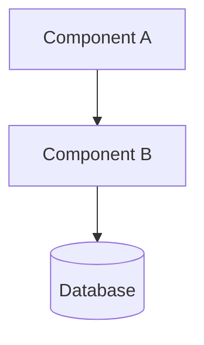

# Design Document: [Feature Name]

## Overview

[High-level summary of the feature, its purpose, and the approach taken]

## Requirements

### Functional Requirements

- [ ] [Requirement 1]
- [ ] [Requirement 2]

### Non-Functional Requirements

| Category     | Requirement                          |
| ------------ | ------------------------------------ |
| Performance  | [e.g., < 200ms response time]        |
| Scalability  | [e.g., Support 10k concurrent users] |
| Security     | [e.g., OAuth 2.0 authentication]     |
| Availability | [e.g., 99.9% uptime]                 |

### Constraints

- **Technology**: [Stack constraints]
- **Timeline**: [Deadline requirements]
- **Resources**: [Team/budget constraints]

---

## Architecture

### System Overview

[Describe how the overall system works at a high level]

### Architecture Diagram



### Component Responsibilities

| Component | Responsibility |
| --------- | -------------- |
| [Name]    | [What it does] |

---

## Components and Interfaces

### [Component Name]

**Purpose**: [What this component does]

**Responsibilities**:

- [Responsibility 1]
- [Responsibility 2]

**Interface**:

```typescript
interface ComponentName {
  method(input: InputType): Promise<OutputType>;
}
```

**Dependencies**: [What it requires]

---

## Data Models

### [Entity Name]

**Purpose**: [What this entity represents]

| Field     | Type   | Required | Description        |
| --------- | ------ | -------- | ------------------ |
| id        | string | Yes      | Unique identifier  |
| name      | string | Yes      | Display name       |
| createdAt | Date   | Yes      | Creation timestamp |

**Validation Rules**:

- [Rule 1]

**Relationships**:

- [e.g., Has many Posts]

**Example**:

```json
{
  "id": "abc123",
  "name": "Example",
  "createdAt": "2024-01-15T10:30:00Z"
}
```

---

## Error Handling

### Error Categories

| Error Type | HTTP Code | User Message           | System Action       |
| ---------- | --------- | ---------------------- | ------------------- |
| Validation | 400       | Specific field error   | Log, return details |
| Auth       | 401       | "Please log in"        | Redirect to login   |
| Not Found  | 404       | "Resource not found"   | Log, return error   |
| Server     | 500       | "Something went wrong" | Log, alert, retry   |

### Recovery Mechanisms

- **Retry Strategy**: [e.g., Exponential backoff, 3 attempts]
- **Fallback**: [e.g., Return cached data]
- **Circuit Breaker**: [e.g., Open after 5 failures]

---

## Testing Strategy

### Unit Testing

- **Coverage Target**: 80%+
- **Focus Areas**: [Critical business logic]
- **Mocking Strategy**: [What to mock]

### Integration Testing

- **Scope**: [Component interactions to test]
- **Environment**: [Test environment setup]
- **Data Strategy**: [Test data approach]

### E2E Testing

- **Critical Paths**: [User journeys to test]
- **Tools**: [Testing tools]

### Performance Testing

- **Load Targets**: [Expected load]
- **Benchmarks**: [Performance requirements]

---

## Decisions

### Decision: [Title]

**Context**: [Situation]

| Option | Pros       | Cons        | Effort |
| ------ | ---------- | ----------- | ------ |
| A      | [Benefits] | [Drawbacks] | Med    |
| B      | [Benefits] | [Drawbacks] | High   |

**Decision**: Option A

**Rationale**: [Why]

**Implications**: [What this means]
